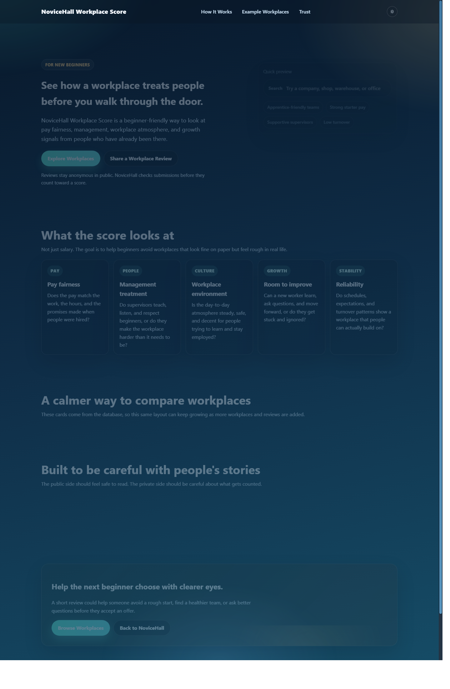
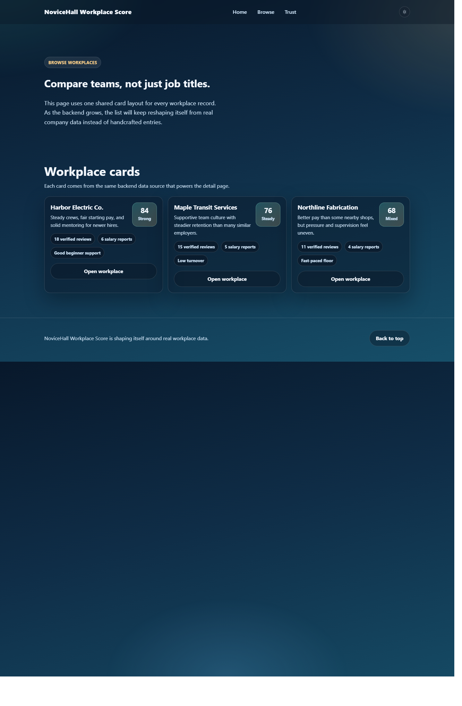
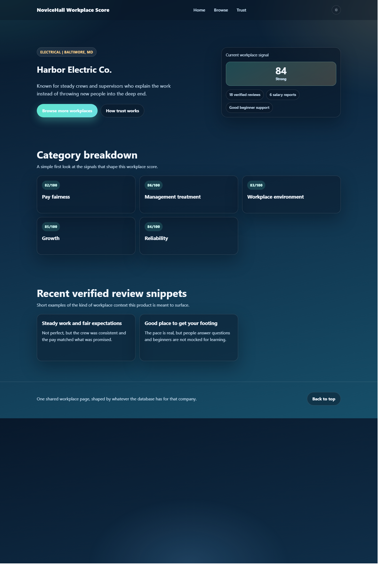

# NoviceHall Workplace Score


NoviceHall Workplace Score is an early-stage workplace review platform aimed at new beginners entering the workforce.

The idea is simple: help people look beyond a job title or salary number and understand what a workplace is actually like through signals such as:
- pay fairness
- management treatment
- workplace environment
- growth for beginners
- overall reliability

This repository currently includes the first backend-backed version of that concept.

## Why This Exists

A lot of people, especially beginners, step into workplaces with very little real information about what daily life there is actually like.

Job descriptions can sound clean while the real experience may involve:
- poor treatment by management
- misleading pay expectations
- no room to learn
- unstable scheduling
- unhealthy team culture

NoviceHall Workplace Score is intended to make those patterns more visible before someone commits their time, energy, or early career momentum.

## What This Repo Contains

- The original `NoviceHall` welcome page
- A separate `Workplace Score` product flow
- A shared workplace detail UI powered by backend data
- An Express server
- A SQLite database with starter workplace data

## Current MVP

The current build supports:
- a main landing page at [`index.html`](./index.html)
- a workplace score landing page at [`workplace-score.html`](./workplace-score.html)
- a browse page at [`companies.html`](./companies.html)
- a shared workplace detail page at [`company.html`](./company.html)
- live workplace data from the backend through:
  - `GET /api/health`
  - `GET /api/workplaces`
  - `GET /api/workplaces/:slug`

The important architectural direction is that all workplace pages use the same UI structure. The page changes based on database content, not based on handcrafted HTML for each employer.

## Stack

- Frontend: HTML, CSS, vanilla JavaScript
- Backend: Node.js + Express
- Database: SQLite with `better-sqlite3`

## Project Files

- [`index.html`](./index.html): original NoviceHall welcome page
- [`workplace-score.html`](./workplace-score.html): workplace-score entry page
- [`companies.html`](./companies.html): workplace listing page
- [`company.html`](./company.html): shared workplace detail template
- [`framework.css`](./framework.css): shared visual system and responsive styling
- [`script.js`](./script.js): shared UI behavior and motion
- [`workplace-app.js`](./workplace-app.js): frontend rendering from API responses
- [`server.js`](./server.js): Express server, database initialization, and API routes

## Preview Pages

Once the local server is running, these are the main pages:

- `/` for the original NoviceHall welcome page
- `/workplace-score.html` for the workplace-score landing page
- `/companies.html` for the workplace browse page
- `/company.html?slug=harbor-electric-co` for an example dynamic workplace detail page

## Screenshots

### Workplace Score Landing



### Workplace Browse



### Shared Workplace Detail



## Quick Start

### 1. Install dependencies

On Windows PowerShell, `npm` may be blocked by script policy. If that happens, use `npm.cmd`.

```powershell
npm.cmd install
```

### 2. Start the server

```powershell
node server.js
```

You should see:

```text
NoviceHall server listening on http://localhost:3000
```

### 3. Open the app

- [http://localhost:3000/](http://localhost:3000/)
- [http://localhost:3000/workplace-score.html](http://localhost:3000/workplace-score.html)
- [http://localhost:3000/companies.html](http://localhost:3000/companies.html)

## API

### `GET /api/health`

Simple health check endpoint.

### `GET /api/workplaces`

Returns the workplace list used by the homepage preview and browse page.

### `GET /api/workplaces/:slug`

Returns a single workplace record with:
- workplace summary
- score and band
- category breakdown
- recent review snippets

Example:

```text
GET /api/workplaces/harbor-electric-co
```

## Product Direction

This project is intended to grow into a system where:
- workplaces gain or lose trust signals over time
- scores change as more reviews are added and approved
- beginners can compare employers before applying
- public reviews stay anonymous while NoviceHall verifies submissions internally

## Next Steps

- Add a `Review Your Workplace` page
- Add `POST /api/reviews`
- Store review submissions separately from published reviews
- Add moderation and verification states
- Recalculate workplace scores from approved data instead of starter seed values
- Add salary submission and aggregation

## Status

This is an early MVP. It is usable locally, the backend is live, and the company pages are already data-driven, but the review submission workflow is not built yet.
